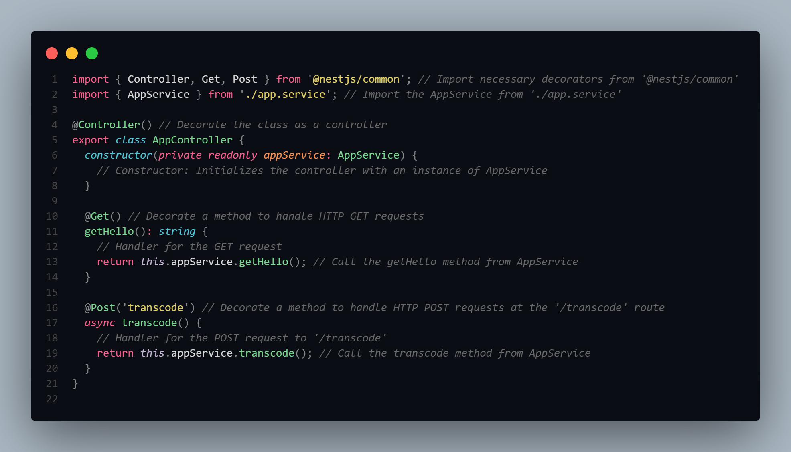
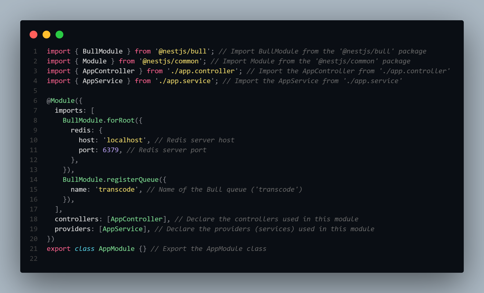
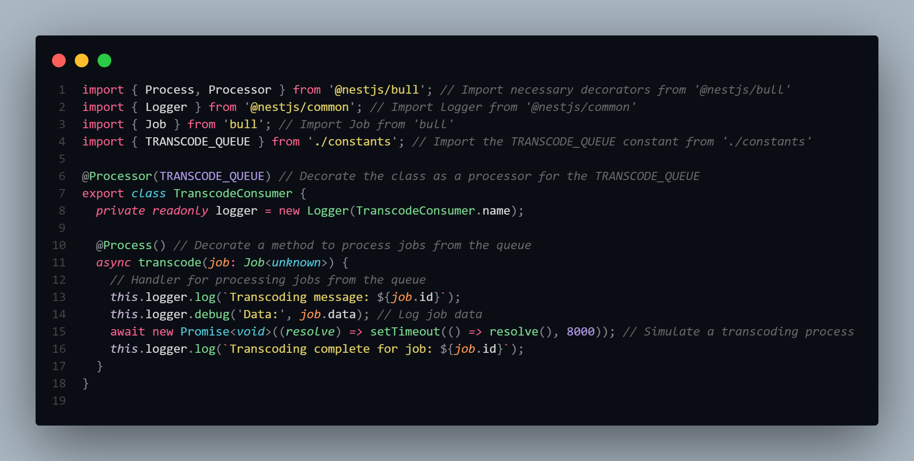
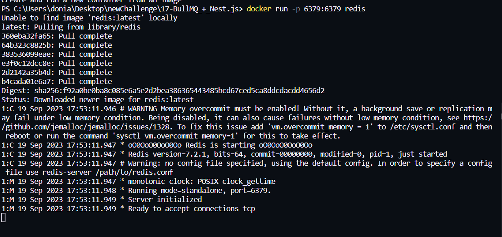
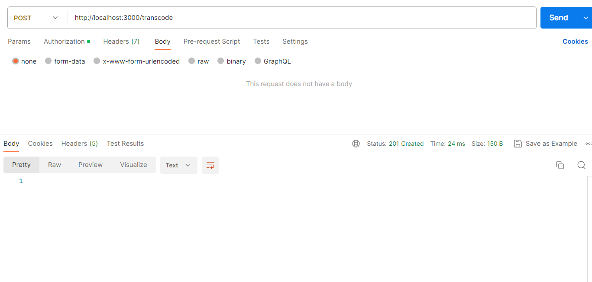

# NestJS and BullMQ: An Overview

This README provides an introduction to NestJS, a powerful Node.js framework, and BullMQ, a robust Redis-based job queue. Learn how to integrate and leverage BullMQ within a NestJS application to manage background tasks efficiently.

## NestJS: A Powerful Node.js Framework

[NestJS](https://nestjs.com/) is a progressive and versatile Node.js framework crafted to build efficient, scalable, and maintainable server-side applications. NestJS combines the best features of modern web development with a strong focus on developer experience, enterprise-grade architecture, and productivity.

Key Features of NestJS:
- **Modular Structure**: Utilizes a modular and organized architecture for clean code and easy maintenance.
- **Dependency Injection**: Promotes the use of dependency injection for flexible and scalable application design.
- **Decorators and Metadata**: Leverages decorators and metadata for enhanced configuration and readability.
- **Middleware**: Allows integration of middleware to process requests globally or at the route level.
- **Interceptors and Guards**: Enables custom interceptors and guards for request/response manipulation and authentication.
- **Exception Handling**: Provides centralized exception handling for consistent error responses.

## BullMQ: A Redis-based Job Queue

[BullMQ](https://docs.bullmq.io/) is a powerful, reliable, and Redis-backed job queue for Node.js applications. It facilitates the execution of background jobs and processing tasks asynchronously.

Key Features of BullMQ:
- **Redis-based**: Utilizes Redis as a backend to manage job queues and ensure durability.
- **Scalability**: Allows effortless scaling of worker processes to handle high volumes of jobs concurrently.
- **Job Priority**: Supports job prioritization to handle critical tasks first.
- **Retries and Timeouts**: Provides built-in mechanisms for job retries and timeouts to enhance job processing reliability.
- **Concurrency Control**: Allows fine-grained control over job concurrency based on queue settings.

## Integrating BullMQ with NestJS

To integrate BullMQ with NestJS, follow these steps:
1. **Installation**: Install BullMQ and necessary dependencies.
   ```bash
   npm install bull bullmq
   ```

Setup BullMQ Service: Create a BullMQ service to manage job queues.

```typescript
import { Injectable } from '@nestjs/common';
import { Queue, Worker, QueueScheduler } from 'bullmq';

@Injectable()
export class BullService {
  userQueue = new Queue('user');
  // ... other queues and configurations
}

```

Define and Process Jobs: Define your job types and their processing logic using BullMQ workers.

```typescript
import { BullService } from './bull.service';

const userQueue = new BullService().userQueue;

const processUserJob = async (job) => {
  // Process the user job here
};

const userWorker = new Worker('user', processUserJob);

```
Dispatch Jobs: Dispatch jobs within your NestJS application wherever needed.


```typescript
import { BullService } from './bull.service';

const userQueue = new BullService().userQueue;

const createUserJob = async () => {
  await userQueue.add('createUser', { data: /* user data */ });
};

```

## Step 1 


| Step 1 | Step 2 | Step 3 | Step 4 | Step 5 | Step 6 |
|--------------|--------------|--------------|--------------|--------------|--------------|
|  |  |  |  |  |  |
