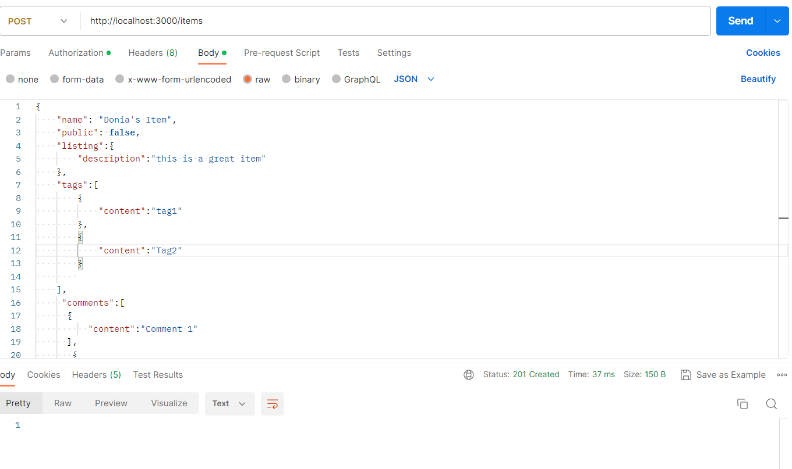
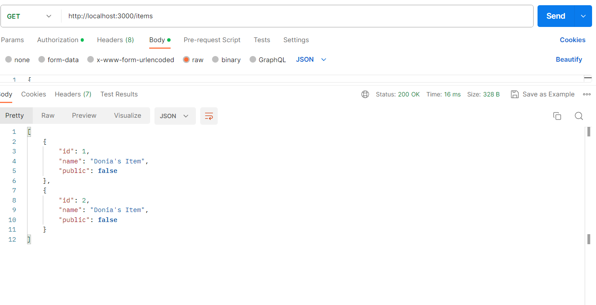
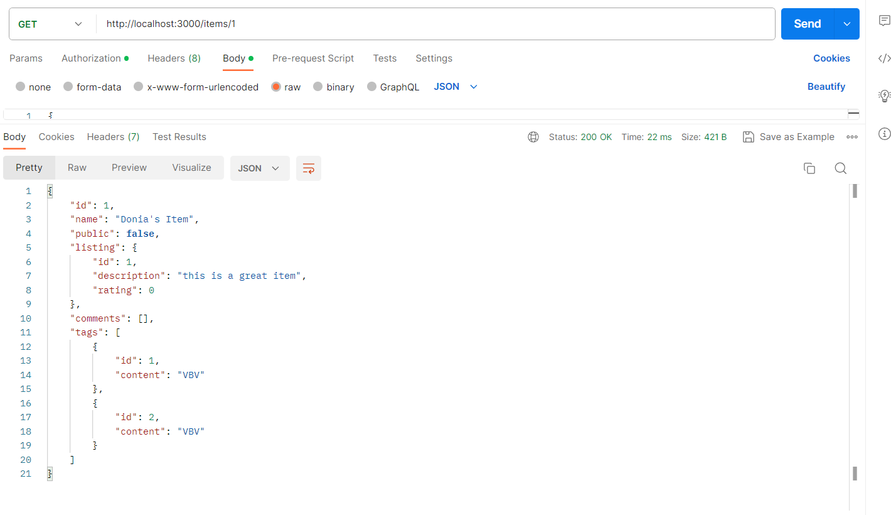
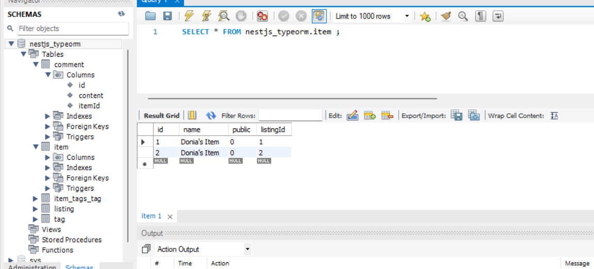
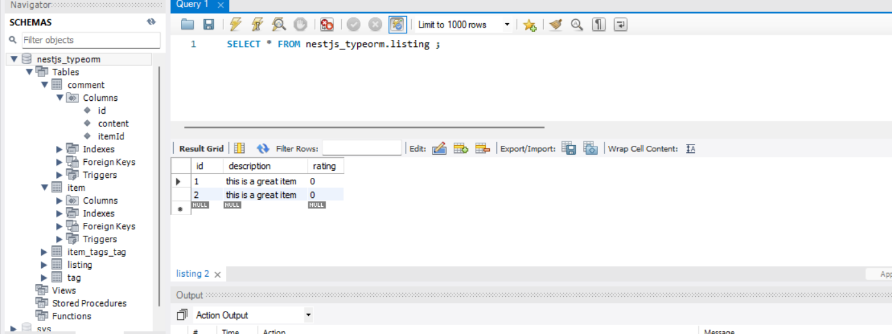
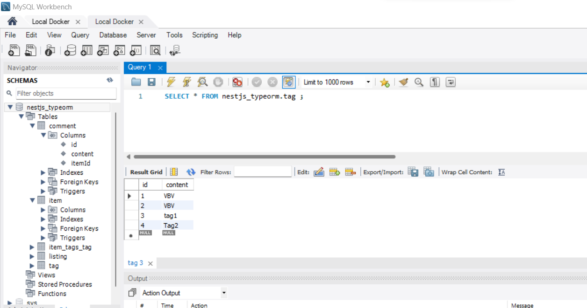
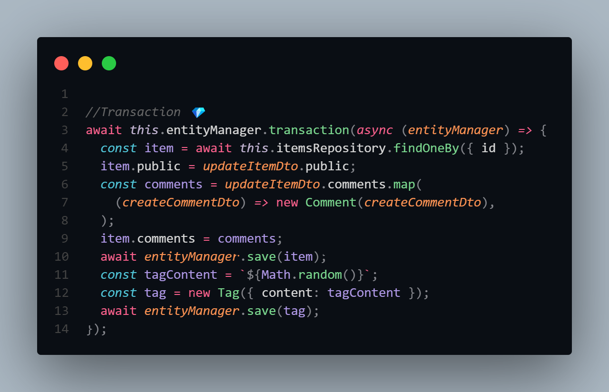
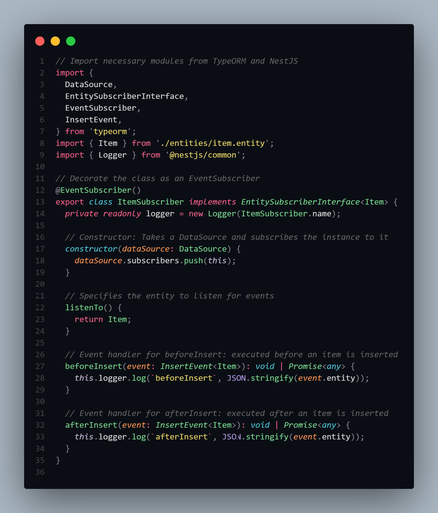
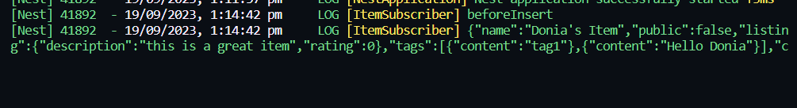

# Entities in TypeORM and NestJS

In the context of TypeORM and NestJS, an "entity" is a TypeScript class that represents a database table or a document in a NoSQL database. Entities define the structure and properties of the data that will be stored in the database.

## Creating an Entity

To create an entity in TypeORM and NestJS, you define a TypeScript class and use decorators provided by TypeORM to specify the mapping between the class and the database table or document.

```typescript
import { Entity, Column, PrimaryGeneratedColumn } from 'typeorm';

@Entity()
export class User {
  @PrimaryGeneratedColumn()
  id: number;

  @Column()
  firstName: string;

  @Column()
  lastName: string;
}

```

# TypeORM Relationships: One-to-One, One-to-Many, Many-to-One, and Many-to-Many

TypeORM is an Object-Relational Mapper (ORM) for TypeScript and JavaScript. It simplifies the process of working with databases by allowing you to define and manage relationships between entities. This README provides an overview of different types of relationships in TypeORM.

## Installation

To use TypeORM, you need to install it and any required dependencies:

```bash
npm install typeorm reflect-metadata @nestjs/typeorm
```

## Setting up TypeORM in NestJS

Module Configuration: Import TypeOrmModule.forRoot() in your NestJS application's main module to configure the TypeORM connection.

Entity Creation: Create TypeScript classes (entities) that represent the tables in your database.

## Defining Relationships

One-to-One Relationship
In a one-to-one relationship, each record in the first entity can be associated with only one record in the second entity, and vice versa.


```typescript
// user.entity.ts
import { Entity, PrimaryGeneratedColumn, OneToOne, JoinColumn } from 'typeorm';
import { UserProfile } from './user-profile.entity';

@Entity()
export class User {
  @PrimaryGeneratedColumn()
  id: number;

  @OneToOne(() => UserProfile)
  @JoinColumn()
  profile: UserProfile;
}

// user-profile.entity.ts
import { Entity, PrimaryGeneratedColumn } from 'typeorm';
import { User } from './user.entity';

@Entity()
export class UserProfile {
  @PrimaryGeneratedColumn()
  id: number;

  // Other profile properties
}

```
## One-to-Many Relationship

In a one-to-many relationship, a record in the first entity can be associated with multiple records in the second entity, but a record in the second entity can be associated with only one record in the first entity.


```typescript
// user.entity.ts
import { Entity, PrimaryGeneratedColumn, OneToMany } from 'typeorm';
import { Order } from './order.entity';

@Entity()
export class User {
  @PrimaryGeneratedColumn()
  id: number;

  @OneToMany(() => Order, order => order.user)
  orders: Order[];
}

// order.entity.ts
import { Entity, PrimaryGeneratedColumn, ManyToOne } from 'typeorm';
import { User } from './user.entity';

@Entity()
export class Order {
  @PrimaryGeneratedColumn()
  id: number;

  @ManyToOne(() => User, user => user.orders)
  user: User;
}

```

## Many-to-Many Relationship

A many-to-one relationship is the inverse of a one-to-many relationship. Many records in the first entity can be associated with a single record in the second entity.

Many-to-Many Relationship
In a many-to-many relationship, records in both entities can be associated with multiple records in the other entity.

```typescript
// post.entity.ts
import { Entity, PrimaryGeneratedColumn, ManyToMany, JoinTable } from 'typeorm';
import { Category } from './category.entity';

@Entity()
export class Post {
  @PrimaryGeneratedColumn()
  id: number;

  @ManyToMany(() => Category)
  @JoinTable()
  categories: Category[];
}

// category.entity.ts
import { Entity, PrimaryGeneratedColumn, ManyToMany } from 'typeorm';
import { Post } from './post.entity';

@Entity()
export class Category {
  @PrimaryGeneratedColumn()
  id: number;

  @ManyToMany(() => Post, post => post.categories)
  posts: Post[];
}

```


## Using TypeORM Relationships
Creating Records: To create associated records, set the related object in your entities and save them.

Fetching Records: TypeORM automatically fetches related records based on the defined relationships.

Querying: Use TypeORM's repository functions to query and filter based on related entities.

## Conclusion
TypeORM simplifies working with databases by allowing you to define and manage relationships in a more intuitive, object-oriented way. Utilize the examples and patterns provided to effectively work with various types of relationships in your applications.

# Screenshots

| Screenshot 1 | Screenshot 2 | Screenshot 3 | Screenshot 4 | Screenshot 5 | Screenshot 6 |
|--------------|--------------|--------------|--------------|--------------|--------------|
|  |  |  |  |  |  |


# Transactions in TypeORM and NestJS

In the context of TypeORM and NestJS, transactions refer to a set of database operations that are performed as a single unit, ensuring data consistency and reliability. Transactions are essential for managing complex operations in a database where multiple actions need to be completed together or rolled back entirely in case of failure.

## Setting up a Transaction in TypeORM

To perform a transaction in TypeORM, you typically follow these steps:

1. **Begin a Transaction**: Start a transaction using the `EntityManager` or `Repository`.

```typescript
const transactionEntityManager = getManager();
await transactionEntityManager.transaction(async transactionalEntityManager => {
  // Your transactional operations
});
```

Perform Transactional Operations: Within the transaction, perform your desired database operations.

Commit the Transaction: If all operations are successful, commit the transaction.

```typescript
await transactionalEntityManager.commitTransaction();

```

Rollback the Transaction: If any operation fails, rollback the transaction to maintain data integrity.

```typescript
await transactionalEntityManager.rollbackTransaction();
```

## Using Transactions in NestJS with TypeORM

In NestJS, you can create a service method that encapsulates your transaction logic:
```typescript
import { Injectable } from '@nestjs/common';
import { EntityManager } from 'typeorm';
import { InjectEntityManager } from '@nestjs/typeorm';

@Injectable()
export class YourService {
  constructor(@InjectEntityManager() private entityManager: EntityManager) {}

  async performTransaction(): Promise<void> {
    const queryRunner = this.entityManager.queryRunner;

    try {
      await queryRunner.connect();
      await queryRunner.startTransaction();

      // Perform your transactional operations
      // Example: await queryRunner.query('INSERT INTO ...');

      await queryRunner.commitTransaction();
    } catch (error) {
      await queryRunner.rollbackTransaction();
      throw new Error('Transaction failed. Rolled back.');
    } finally {
      await queryRunner.release();
    }
  }
}

```

## Conclusion
Transactions in TypeORM and NestJS are crucial for maintaining data consistency and ensuring that complex database operations are executed reliably. Utilize the provided examples to set up and manage transactions effectively in your applications.



# TypeORM Subscriber

In TypeORM, a subscriber is a class that can listen to specific entity events or any entity events. When a particular event is triggered, the subscriber can execute custom logic. This README provides an overview of creating and using a subscriber in TypeORM.

## What is a Subscriber?

A subscriber is a TypeScript class that is decorated with `@EventSubscriber()`. This decorator marks the class as an event subscriber, allowing it to listen to specific entity events or all entity events. Subscribers can execute custom logic before or after these events occur.

```typescript
import { EventSubscriber, EntitySubscriberInterface, InsertEvent } from 'typeorm';
import { YourEntity } from './your-entity.entity';

@EventSubscriber()
export class YourEntitySubscriber implements EntitySubscriberInterface<YourEntity> {
  listenTo() {
    return YourEntity;
  }

  beforeInsert(event: InsertEvent<YourEntity>): void {
    // Custom logic before an entity of type YourEntity is inserted
  }
}
```

In the above example:

@EventSubscriber() decorator marks the class as an event subscriber.
listenTo() method specifies the entity to listen for events.
beforeInsert() method is an event handler that is executed before an entity is inserted.


