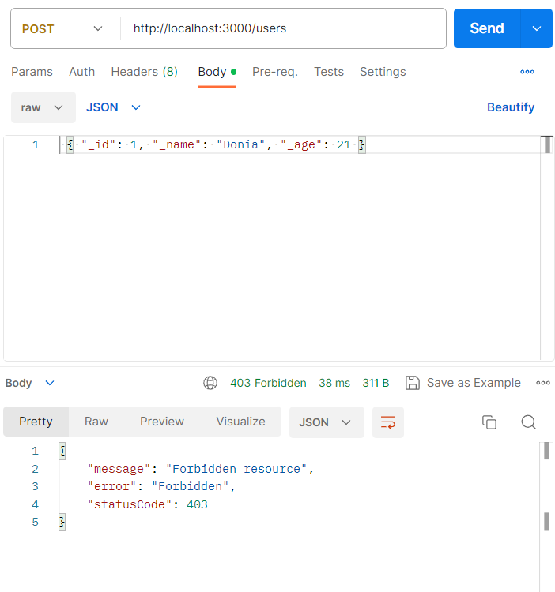
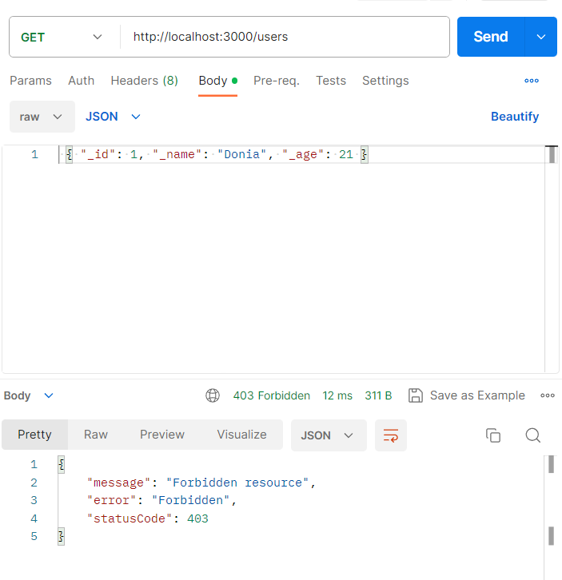
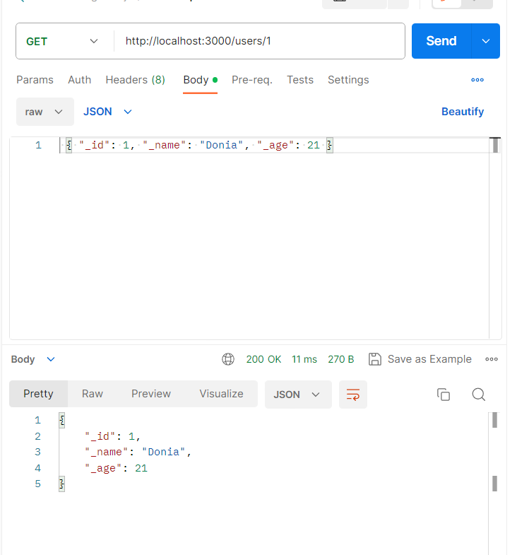

# Guards in NestJS

## Introduction

Guards in NestJS are classes annotated with the `@Injectable()` decorator that implement the `CanActivate` interface.

Guards have a single responsibility: to determine whether a given request will be handled by the route handler or not, based on certain conditions (like permissions, roles, ACLs, etc.) present at run-time. This process is often referred to as authorization. While middleware is a fine choice for authentication, Guards are more suited for this purpose as they have knowledge of what's going to be executed next in the request/response cycle.

## Purpose

The main purposes of Guards in NestJS are:

1. **Authorization**: Guards are excellent for handling authorization, ensuring that specific routes are accessible only to users with sufficient permissions.

2. **Request Filtering**: They allow you to filter and process requests based on certain criteria before they reach the route handlers.

3. **Declarative Processing**: Guards enable you to interpose processing logic at specific points in the request/response cycle in a declarative and efficient manner.

## How to Use

To use Guards in your NestJS application:

1. **Create a Guard**: Create a custom Guard by implementing the `CanActivate` interface or by using the `@Injectable()` decorator.

2. **Define Guard Logic**: Implement the logic to determine if a request can proceed or not within the Guard.

3. **Apply Guard**: Apply the Guard to the desired controllers or routes using the `@UseGuards()` decorator.

## Screenshots

| Guard-1.png | Guard-2.png | Guard-3.png | Guards_1.png |
|--------------|--------------|--------------|--------------|
|  |  |  |  |


## Example

Below is a simple example of creating and using a Guard for authorization in NestJS:

```typescript
import { Injectable, CanActivate, ExecutionContext } from '@nestjs/common';
import { Observable } from 'rxjs';

@Injectable()
export class AuthGuard implements CanActivate {
  canActivate(
    context: ExecutionContext,
  ): boolean | Promise<boolean> | Observable<boolean> {
    const request = context.switchToHttp().getRequest();
    return validateRequest(request);
  }
}
```

In your controller:

```typescript
import { Controller, Get, UseGuards } from '@nestjs/common';
import { AuthGuard } from './auth.guard';

@Controller('example')
export class ExampleController {
  @Get('secure')
  @UseGuards(new AuthGuard())
  secureRoute(): string {
    return 'This route is secure!';
  }
}
```
 
## Contributing

Feel free to contribute to enhance this documentation. If you have suggestions, improvements, or find errors, please submit a pull request.